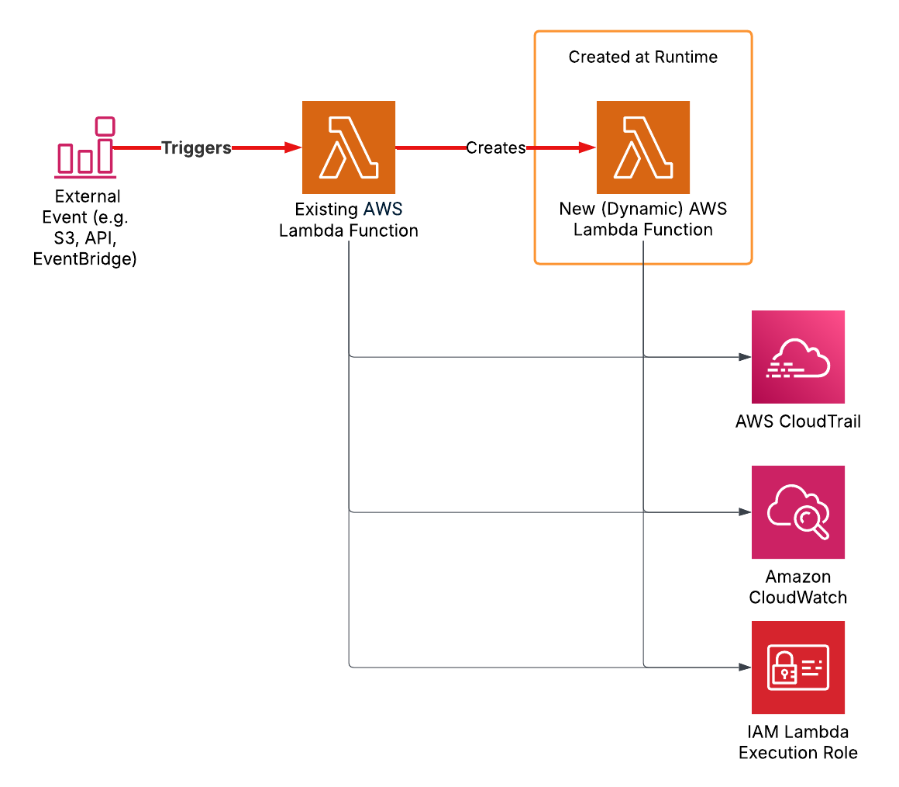

# Lambda Creates Lambda

A serverless solution that allows an AWS Lambda function to dynamically create additional Lambda functions.

## Overview

This project demonstrates how to create AWS Lambda functions programmatically from within another Lambda function. It's useful for scenarios where you need to dynamically provision serverless resources based on runtime conditions.

## Architecture

Below is a simplified diagram of the flow:



An external event (e.g., from S3, API Gateway, or EventBridge) triggers the existing Lambda function. This function dynamically creates a new Lambda function at runtime, assigning it an IAM role and enabling observability via CloudTrail and CloudWatch.

For a full explanation of the design pattern, use cases, and security practices, refer to the [blog post](https://your-blog-link.com).

## Features

- Creates Lambda functions on-demand from within a Lambda function
- Configures the new Lambda with appropriate runtime, memory, and timeout settings
- Passes environment variables to the newly created function
- Supports ARM64 architecture for cost optimization

## Requirements

- AWS account with appropriate permissions
- IAM role with Lambda execution permissions
- Python 3.11+
- Boto3 library

## Usage

1. Update the IAM role ARN in the script with your Lambda execution role
2. Deploy the Lambda function to your AWS account
3. Invoke the function with a JSON payload:

```json
{
  "name": "my-dynamic-function"
}
```

If no name is provided, it will use the default template name "mytemplate".

## Configuration

The following variables can be customized:

- `region`: AWS region to deploy to (default: us-east-1)
- `lambdas_iam_role`: IAM role ARN for Lambda execution
- `myvar`: Environment variable passed to created functions
- `template_name`: Default name for created Lambda functions

## Security Considerations

This Lambda requires elevated IAM permissions to create other Lambda functions. Follow the principle of least privilege when configuring the execution role.

## License

[MIT License](LICENSE)
